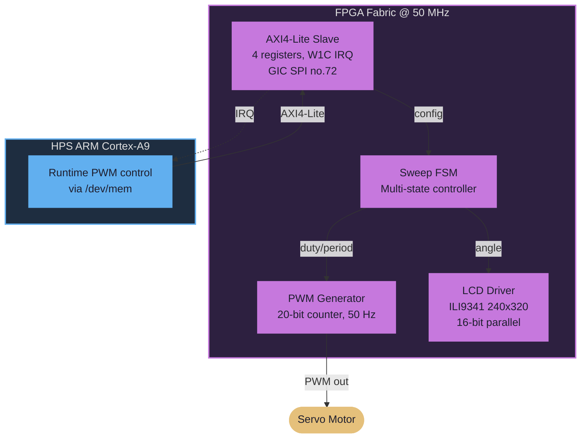
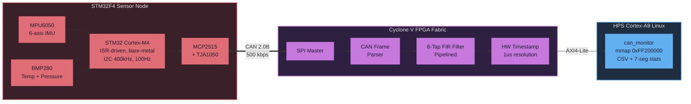
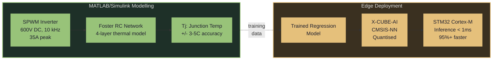
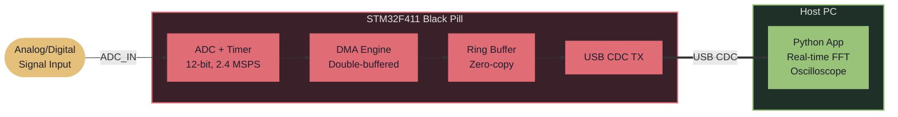
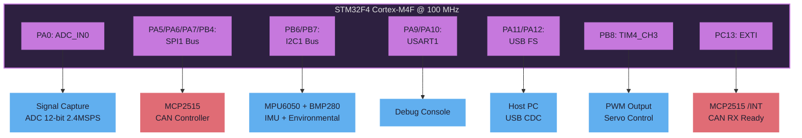
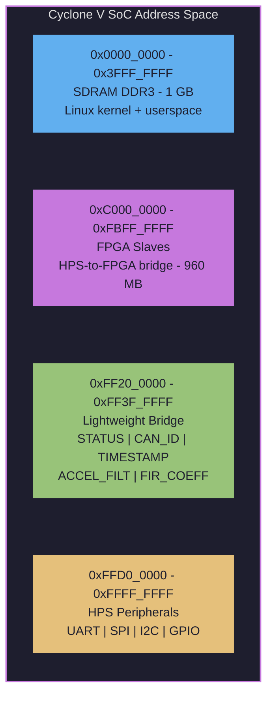

<p align="center">
  
</p>

<p align="center">
  <a href="mailto:sanjeevsaravanakumarx1@gmail.com"></a>&nbsp;
  <a href="https://linkedin.com/in/sanjeev-kumarx2"></a>&nbsp;
  <a href="https://github.com/sanjusaravananx2-hub"></a>&nbsp;
  
</p>

<p align="center">
  
</p>

<br>

## `> whoami`

```c
#define ENGINEER "Sanjeev Kumar"

typedef struct {
    const char *name;
    const char *degree;
    const char *university;
    const char *graduation;
    const char *focus[5];
} embedded_engineer_t;

static const embedded_engineer_t me = {
    .name       = ENGINEER,
    .degree     = "MSc Embedded Systems Engineering",
    .university = "University of Leeds",
    .graduation = "September 2026 (Predicted First Class)",
    .focus      = {
        "FPGA & Digital Design (Verilog HDL)",
        "ARM Cortex-M/A Firmware (bare-metal & RTOS)",
        "Hardware-Software Co-Design on SoC",
        "Real-Time Signal Processing & Edge AI",
        NULL
    }
};
```

<br>

## `> cat /proc/skills`

<table>
<tr><td>

**HDL & Digital Design**


**FPGA & EDA Tools**


</td><td>

**Languages**


**Embedded Platforms**


</td></tr>
</table>

<p align="center">
  
  
  
  
  
  
  
  
</p>

<br>

## `> ls ~/projects/`

<!-- ==================== PROJECT 1 ==================== -->

<table>
<tr><td>

###  &nbsp; FPGA Servo Motor Control System

   



**~900 lines of synthesizable Verilog. Zero IP cores. Zero soft processors.**

- Full RTL flow: simulation ➜ synthesis ➜ P&R ➜ timing closure at **50 MHz**
- On-chip debug with **SignalTap II** logic analyser
- W1C interrupt latch connected to GIC SPI #72 for HPS notification

<details>
<summary>RTL Module Breakdown</summary>

| Module | Lines | Function |
|:-------|------:|:---------|
| `pwm_generator.v` | 180 | 20-bit counter, configurable period & duty |
| `sweep_fsm.v` | 200 | Multi-state FSM, sweep patterns |
| `lcd_driver.v` | 280 | ILI9341 16-bit parallel, init FSM, gauge |
| `axi4_lite_slave.v` | 240 | 4-register map, write-strobe, W1C IRQ |

</details>

</td></tr>
</table>

<!-- ==================== PROJECT 2 ==================== -->

<table>
<tr><td>

###  &nbsp; CAN Bus Sensor Fusion Platform

    



- Custom Verilog IP -- **90% latency reduction** vs software implementation
- HW timestamping + FPGA pipeline -- **35% data throughput improvement**
- Real 2-node CAN 2.0B network at 500 kbps with hardware filtering

<details>
<summary>FPGA Register Map (base 0xFF200000)</summary>

| Offset | Register | R/W | Description |
|:-------|:---------|:---:|:------------|
| `0x00` | STATUS | R | `[0]` frame_valid `[1]` error `[15:8]` err_count |
| `0x04` | CAN_ID | R | `[10:0]` Latest CAN ID |
| `0x08` | DATA_LO | R | CAN bytes `[3:0]` |
| `0x0C` | DATA_HI | R | CAN bytes `[7:4]` |
| `0x10` | TIMESTAMP | R | 32-bit HW timestamp (1 us) |
| `0x14` | ACCEL_RAW | R | Raw accel X/Y/Z (int16) |
| `0x20` | ACCEL_FILT | R | FIR-filtered (int32) |
| `0x30` | FIR_COEFF | W | Coefficient write (8 taps) |
| `0x40` | FRAME_CNT | R | Total frames received |
| `0x44` | ERROR_CNT | R | Total errors detected |

</details>

<details>
<summary>CAN Message Protocol</summary>

| CAN ID | Payload | DLC | Rate |
|:-------|:--------|:---:|:-----|
| `0x100` | Accel X/Y/Z (3 x int16) | 6 | 100 Hz |
| `0x101` | Gyro X/Y/Z (3 x int16) | 6 | 100 Hz |
| `0x102` | Temp + Pressure | 6 | 10 Hz |
| `0x1FF` | Frame count + Uptime | 6 | 1 Hz |

All standard 11-bit IDs @ 500 kbps

</details>

</td></tr>
</table>

<!-- ==================== PROJECT 3 ==================== -->

<table>
<tr><td>

###  &nbsp; AI Thermal Prediction — EV Inverter

   



- 4-layer Foster RC thermal network — validated **±3–5°C** vs datasheet
- Edge deployment via X-CUBE-AI/CMSIS-NN — **95%+ inference latency reduction**
- Bridging physics-based modelling with on-chip machine learning

</td></tr>
</table>

<!-- ==================== PROJECT 4 ==================== -->

<table>
<tr><td>

###  &nbsp; STM32 USB Signal Analyser

    



- Real-time oscilloscope + FFT analyser on bare-metal STM32
- DMA double-buffering for **zero-copy** continuous acquisition
- USB CDC high-throughput streaming to Python host

</td></tr>
</table>

<br>

## `> cat /proc/mcu/pinout`



<br>

## `> cat /sys/bus/memory_map`



<br>

## `> cat /etc/experience`

| Role | Organisation | Period |
|:-----|:------------|:-------|
| **Avionics & Propulsion Engineer** | Gryphon Arrows — IMechE UAS Challenge | Oct 2025 — Present |
| **Vehicle Dynamics Engineer** | Leeds Gryphon Racing — Formula Student EV | Oct 2025 — Present |
| **Embedded Systems Engineer** (Industrial Placement) | InTrainz, India | Feb 2024 — Sep 2024 |

<br>

## `> cat /etc/education`

| Degree | Institution | Period |
|:-------|:-----------|:-------|
| **MSc Embedded Systems Engineering** (Predicted 1st) | University of Leeds | 2025 — 2026 |
| **B.Eng Electronics & Communication** (1st with Distinction) | Sathyabama Institute, Chennai | 2021 — 2025 |

<br>

## `> cat /etc/certs`

<p>
  
  
  
  
</p>

<br>

## `> top -b | head`

<p align="center">
  
  
</p>

<p align="center">
  
</p>

<br>

## `> tail -f /var/log/activity.log`

<p align="center">
  
</p>

---

<p align="center">
  
</p>

<p align="center">
  
</p>

<p align="center">
  <i>"The best interface between hardware and software is a well-defined register map."</i>
</p>
