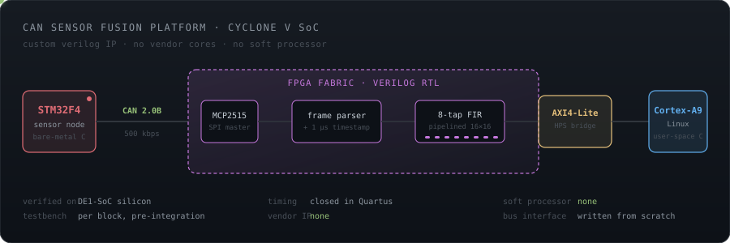

<p align="center">
  
</p>

<p align="center">
  <a href="mailto:sanjusaravananx1@gmail.com"></a>&nbsp;
  <a href="https://linkedin.com/in/sanjeev-kumarx2"></a>&nbsp;
  <a href="https://github.com/sanjusaravananx2-hub"></a>&nbsp;
  
</p>

<p align="center">
  
</p>

<br>

## `> dmesg | grep flagship`

<p align="center">
  
</p>

<br>

## `> whoami`

```c
typedef struct {
    const char *name;
    const char *degree;
    const char *university;
    const char *graduating;
    const char *focus[5];
} engineer_t;

static const engineer_t me = {
    .name       = "Sanjeev Kumar",
    .degree     = "MSc Embedded Systems Engineering",
    .university = "University of Leeds",
    .graduating = "September 2026 (Predicted Distinction)",
    .focus      = {
        "FPGA & digital design in Verilog / VHDL",
        "Testbench-driven verification, then silicon",
        "Bare-metal firmware on ARM Cortex-M",
        "Hardware-software co-design on heterogeneous SoC",
        NULL
    }
};
```

I work on the boundary between software and hardware, and I like the part where you
find out whether the thing you built actually behaves the way you claimed. Most of what
is here was built solo, from architecture through to a board on the desk.

<br>

## `> cat /proc/skills`

<table>
<tr><td width="50%" valign="top">

**HDL &amp; Digital Design**


**FPGA Flow &amp; EDA**


</td><td width="50%" valign="top">

**Languages**


**Embedded &amp; Interfaces**


</td></tr>
</table>

<br>

## `> ls -la ~/projects`

<table>
<tr><td width="55%" valign="top">

### 01 &nbsp;CAN Sensor Fusion Platform
`Verilog RTL` `AXI4-Lite` `Cyclone V SoC` `Cortex-A9 Linux`

A four-stage heterogeneous platform, built end to end. Custom
Verilog IP on the FPGA fabric with **no vendor cores and no soft
processor**: SPI master, a register-level MCP2515 driver written
from the datasheet, a CAN frame parser, a 1&nbsp;&micro;s hardware
timestamp unit and an 8-tap pipelined FIR.

Every block got its own self-checking testbench before integration.
Then I found the bug that only ever reproduced on silicon: the data
register was written a cycle ahead of the valid flag, so the CPU
could latch a half-updated word.

<a href="https://github.com/sanjusaravananx2-hub/Can-sensor-fusion"></a>

</td><td width="45%" valign="top">

### 02 &nbsp;Predictive Thermal Protection
`STM32F411` `C` `MATLAB/Simulink` `MSc Thesis`

Replaces a reactive thermistor with a model that predicts IGBT
junction temperature on the MCU.

| | |
|---|---|
| Hazardous conditions caught | **47 / 47**, never late |
| Thermistor baseline | 21 / 47 |
| Inference | **284.7 &micro;s** @ 96 MHz |
| Processor load | **2.85 %** |
| Footprint | 7,868 B flash, 0 B RAM |

Evaluated int8 via CMSIS-NN and **rejected it**: 17 % faster, but
worst-case error went from 1.35 to 11.51 &deg;C. The benchmark
decided, not preference.

<a href="https://github.com/sanjusaravananx2-hub/AI-driven-Thermal-analysis-of-an-Ev-inverter-using-STM32"></a>

</td></tr>
<tr><td valign="top">

### 03 &nbsp;AR PCB Debugger &nbsp;🥇
`STM32F411` `USB CDC` `OpenCV` `ArUco`

Firmware streams live GPIO, ADC and timer state over USB at 30 Hz
while a Python host tracks the physical board by computer vision and
overlays pin state and waveforms onto it in real time.

Built solo in two days because the existing debug workflow was
tedious. **1st place, EGN Build-a-thon 2026.**

<a href="https://github.com/sanjusaravananx2-hub/ar-pcb-debugger"></a>

</td><td valign="top">

### 04 &nbsp;STM32 USB Signal Analyser
`STM32F411` `DMA` `FFT` `USB CDC`

A real-time USB oscilloscope and FFT analyser on a Black Pill.
Bare-metal C with DMA double-buffering feeding a streaming USB CDC
link, plotted by a Python host.

<a href="https://github.com/sanjusaravananx2-hub/stm32-usb-signal-analyser"></a>

</td></tr>
</table>

<br>

## `> git log --stat`

<p align="center">
  
  
</p>

<br>

## `> tail ~/.education`

**MSc Embedded Systems Engineering** &nbsp;&middot;&nbsp; University of Leeds &nbsp;&middot;&nbsp; 2025 to 2026 &nbsp;&middot;&nbsp; *Predicted Distinction*
<br><sub>Hardware/Software Co-Design &middot; Real-Time Systems &middot; Digital Signal Processing &middot; Advanced Control &middot; Course Representative</sub>

**BEng Electronics &amp; Communication Engineering** &nbsp;&middot;&nbsp; Sathyabama Institute of Science &amp; Technology &nbsp;&middot;&nbsp; *First Class with Distinction*

**Published** &nbsp;&middot;&nbsp; *Multi-Object Trajectory Prediction for Moving Object Localisation* &nbsp;&middot;&nbsp; *Enhanced Fish Freshness Detection Using Image Processing Techniques*

<br>

<p align="center">
  
</p>
